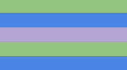
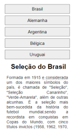
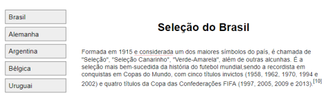
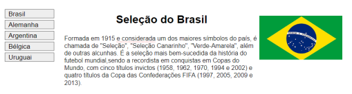

<h1 align="center">Exercícios - Media Query</h1>

# Atividades
| Nome | Código |Página Web | 
| ---- | ------ |--------- | 
| **Questão 01** | [HTML](./questao01.html) [CSS](./assets/css/questao01.css) | [Página Web](https://izaias.me/tecnologias-web/assignments/media-query/questao01.html) |
| **Questão 02** | [HTML](./questao02.html) [CSS](./assets/css/questao02.css) | [Página Web](https://izaias.me/tecnologias-web/assignments/media-query/questao02.html) |
| **Questão 03** | [HTML](./questao03.html) [CSS](./assets/css/questao03.css) | [Página Web](https://izaias.me/tecnologias-web/assignments/media-query/questao03.html) |
| **Questão 04** | [HTML](./questao04.html) [CSS](./assets/css/questao04.css) | [Página Web](https://izaias.me/tecnologias-web/assignments/media-query/questao04.html) |

# Roteiro
## Questão 01
Faça uma DIV mudar de cor segundo a tabela abaixo. Quando a tela estiver no mínimo da largura demonstrada na tabela a cor referente a largura deverá ser empregada.

| Largura | Cor |
| ------- | --- |
| 320 | Preto |
| 480 | Azul claro |
| 600 | Verde claro |
| 768 | Amarelo claro |
| 800 | Marrom |
| 1024 | Azul escuro |
| 1280 | Verde escuro |
| 1440 | Vermelho escuro |

## Questão 02
Faça uma DIV que somente será exibida em dispositivo que estiver na orientação de paisagem.

## Questão 03
Crie a responsividade necessária para que a página tenha os comportamentos descritos abaixo.

a) Dispositivos móveis (celular)

b) Desktop

c) TV

## Questão 04

a) Dispositivos móveis (celular)

b) Desktop

c) TV

### Referências de Consulta
- [Mozilla Developers - Media Query](https://developer.mozilla.org/pt-BR/docs/Web/CSS/Media_Queries/Using_media_queries)